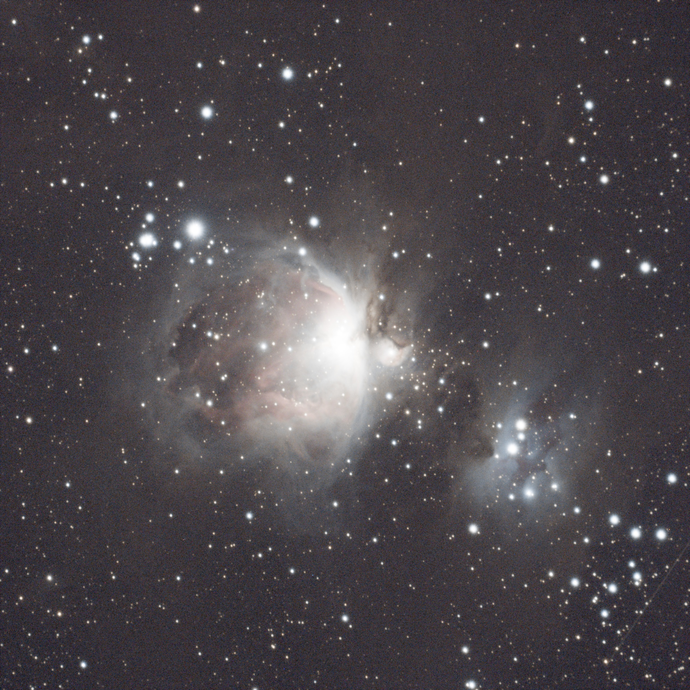
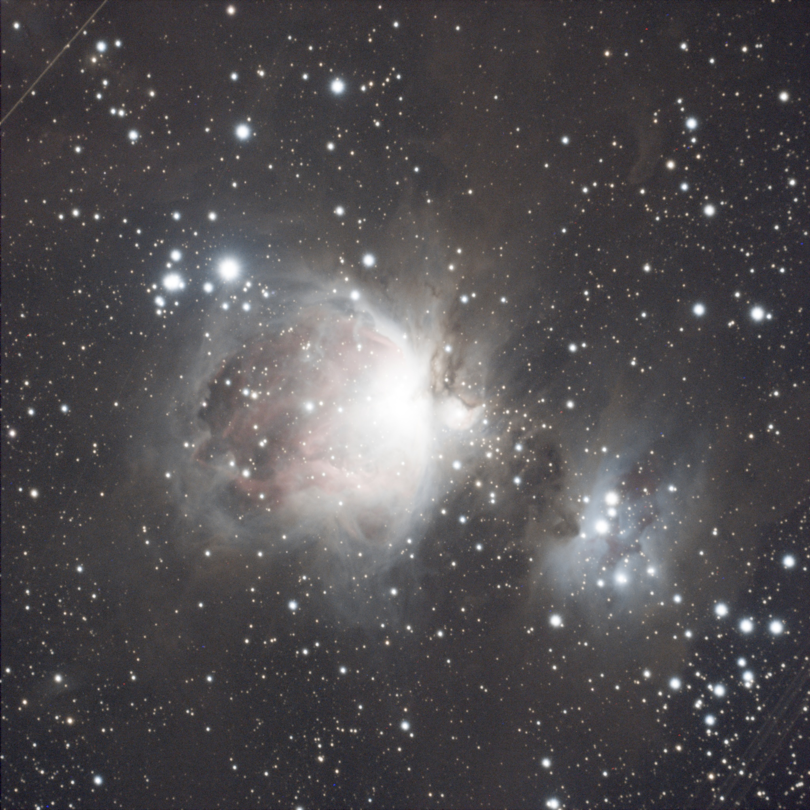
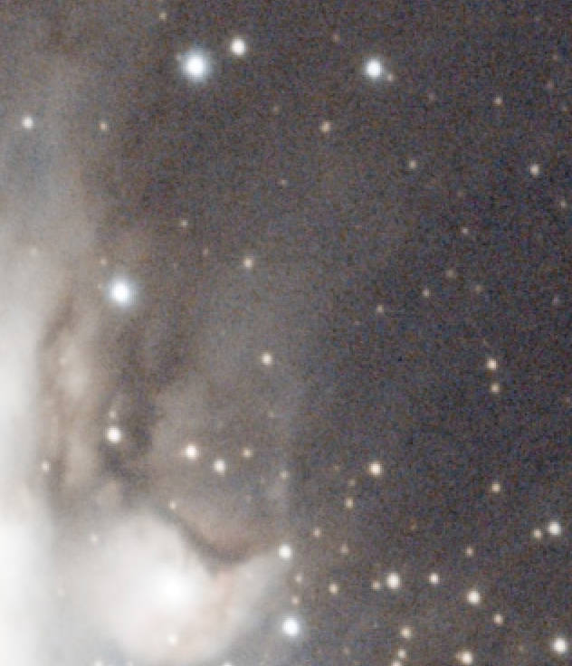
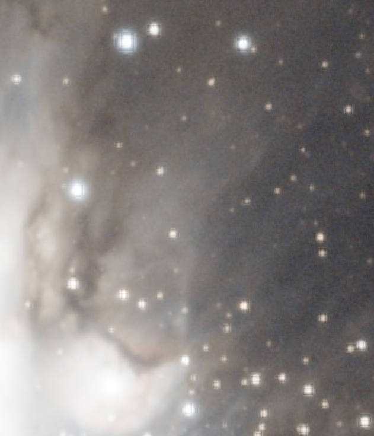

# RASPAstroStacker


## Introduction
An implementation for astronomy image stack. \
Regisitration, Alignment and realtime Stack Process(RASP). \
Here are example of our implementation.

| origin image                          | result of stacking 14 images          |
|---------------------------------------|---------------------------------------|
|          |         |
|  |  |


## Requirments
```
pip install -r requirements.txt
```


## Usage
1. git clone this repo
```
git clone https://github.com/CHMimilanlan/RASPStacker.git
```
2. Make a directory including you files to process
3. (Optional) If you want to debug, make a debug directory
4. Here is a demo for directly using our implementation
```
fits_path = r"C:\Workman02\python\OtherProject\pic\2022-12-24-M42-raw-ImageStack\Data\sample1"
dp = "debug_tmp" # debug tmp dir
do_debug = True
fits_path = Path(fits_path)
iso = ISO(fits_path, dp)
res = iso.ImageStackProcess(do_debug)
cv2.imwrite("stack_res.jpg", res)
```

## :dart: Update Log
[24/10/16] Update for outliers point removement.